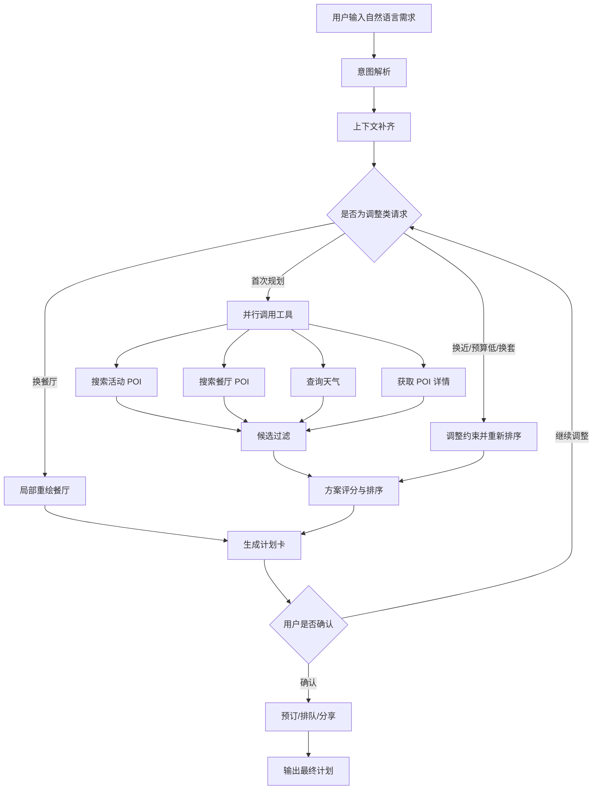

# 周末规划助手 Agent 产品补充文档

## 文档目的

本文档用于补充当前 Demo 的产品表达材料，重点说明：Agent 如何工作、如何评估、如何控制边界，以及当前版本相比早期原型新增了哪些多轮调整和推荐质量能力。

---

## 1. Agent 流程图

### 1.1 核心流程



### 1.2 ReAct 工作机制

| 阶段    | Agent 行为     | 当前 Demo 体现                               |
| ------- | -------------- | -------------------------------------------- |
| Reason  | 理解目标和约束 | 识别亲子、朋友、情侣、宠物、预算、距离、时间 |
| Act     | 调用工具       | POI 搜索、天气、POI 详情、可用性检查         |
| Observe | 读取结果       | 获取活动/餐厅/天气/营业状态/距离             |
| Reason  | 过滤与排序     | 排除医院类 POI、闭馆场馆、超预算/过远组合    |
| Final   | 输出方案       | 计划卡展示时间轴、路线、人均费用、确认入口   |

### 1.3 用户视角流程

| 步骤 | 用户看到什么           | 用户需要做什么                       |
| ---- | ---------------------- | ------------------------------------ |
| 1    | 输入一句需求           | 描述目标                             |
| 2    | 系统生成方案卡         | 看活动、餐厅、时间、路线、预算       |
| 3    | 点击继续问             | 换餐厅、换活动、换近一点、预算低一些 |
| 4    | 系统局部重绘或重新排序 | 对比新方案                           |
| 5    | 确认方案               | 决定是否预订、保存或分享             |

当前用户视角隐藏内部指标、工具可靠性、风险控制长说明等技术内容，只保留决策所需信息。

---

## 2. 产品边界

| 能力类型  | 是否自动   | 说明                               |
| --------- | ---------- | ---------------------------------- |
| 意图解析  | 自动       | 将自然语言转为结构化槽位           |
| POI 搜索  | 自动       | 查询候选活动、餐厅、景点、酒店     |
| 天气查询  | 自动       | 按行程日期查询实时或预报天气       |
| 路线估算  | 自动       | 判断活动和餐厅是否顺路             |
| 方案排序  | 自动       | 按距离、人群、时间、预算、天气排序 |
| 局部重绘  | 自动       | 用户明确反馈后只替换对应节点       |
| 预订/下单 | 用户确认后 | 涉及时间承诺和交易，必须确认       |
| 支付      | 不自动     | Demo 不做自动支付                  |
| 退款/售后 | 不支持     | 超出当前生活规划助手边界           |

---

## 3. 工具调用清单

| 工具名                     | 工具类型 | 触发时机     | 输出                             | 权限        |
| -------------------------- | -------- | ------------ | -------------------------------- | ----------- |
| `parse_intent`           | 意图解析 | 用户输入后   | 人群、时间、预算、距离、反馈类型 | 自动        |
| `fetchLocation`          | 位置工具 | 开始规划     | 城市、区县、经纬度               | 授权/降级   |
| `search_activities`      | POI 搜索 | 需要活动候选 | 活动/景点列表                    | 自动        |
| `search_restaurants`     | POI 搜索 | 需要餐饮候选 | 餐厅列表                         | 自动        |
| `search_hotels`          | POI 搜索 | 两天一夜场景 | 酒店/民宿列表                    | 自动        |
| `fetchAmapPoiDetail`     | POI 详情 | 获取营业信息 | 电话、营业字段、详情             | 自动        |
| `fetchWeather`           | 天气     | 规划前       | 天气、降水、目标日期             | 自动        |
| `filterValidActivities`  | 过滤     | POI 返回后   | 排除无效活动 POI                 | 自动        |
| `selectWithLLM`          | 决策     | 候选生成后   | 活动+餐厅组合                    | 自动/可降级 |
| `localRepaintRestaurant` | 局部重绘 | 换餐厅反馈   | 新餐厅节点                       | 自动        |
| `executeBookings`        | 执行     | 用户确认后   | 预订/出票模拟结果                | 强确认      |
| `share_plan`             | 分享     | 用户确认后   | 分享卡                           | 确认后      |

---

## 4. 异常兜底策略

| 异常场景                           | 当前策略                       | 用户侧表现           |
| ---------------------------------- | ------------------------------ | -------------------- |
| 工作日说“今天下午”但属于周末场景 | 自动指向最近周六下午           | 显示“周六下午方案” |
| 天气日期不一致                     | 按 `targetDate` 查询天气     | 周末方案显示周末天气 |
| POI 返回医院/药房等                | 黑名单过滤                     | 不作为活动展示       |
| 故宫等特殊场馆临近闭馆             | 特殊规则过滤/标注              | 不安排晚间临时行程   |
| 用户嫌远                           | 收紧距离阈值到 5/3/2km         | 新方案明显更近       |
| 用户嫌贵                           | 保留原人群和时间，优先低价组合 | 不误变成默认朋友局   |
| 用户不想吃当前餐厅                 | 局部重绘餐厅                   | 活动锁定，餐厅替换   |
| 工具失败                           | 降级到默认/Mock/规则结果       | 仍输出可用方案       |
| 预订失败                           | 降级为跳转或电话确认           | 不自动承诺真实交易   |

---

## 5. 方案评分规则

当前推荐不是单纯按评分排序，而是按场景动态调整权重。

### 5.1 默认权重

```text
综合得分 = 距离匹配 + 人群匹配 + 时间合理 + 预算匹配 + 天气适配 + 评分热度 + 可执行性
```

### 5.2 场景策略

| 场景       | 权重倾向                                      |
| ---------- | --------------------------------------------- |
| 亲子放电   | 儿童友好 > 安全 > 距离 > 餐厅适配 > 价格      |
| 朋友聚会   | 互动性 > 容纳人数 > 预算 > 晚餐氛围           |
| 情侣约会   | 氛围 > 路线顺 > 拍照/体验 > 餐厅私密性        |
| 宠物出行   | 宠物友好为硬约束，优先户外/草坪/可携宠餐厅    |
| 换近一点   | 距离作为首要排序，不让高评分远距离 POI 顶上来 |
| 预算低一些 | 价格作为首要排序，同时保留原人群和时间        |

---

## 6. 评估指标

### 6.1 北极星指标

| 指标             | 定义                                                   | 目标   |
| ---------------- | ------------------------------------------------------ | ------ |
| 可执行计划完成率 | 用户获得活动 + 餐厅 + 路线 + 时间 + 预算的完整方案比例 | ≥ 90% |

### 6.2 任务指标

| 指标            | 定义                             |
| --------------- | -------------------------------- |
| 首轮方案采纳率  | 用户不修改直接确认方案的比例     |
| 平均规划耗时    | 从输入到输出方案卡的时间         |
| 预订/跳转转化率 | 用户确认方案后进入执行动作的比例 |
| 分享率          | 用户导出或分享计划卡的比例       |
| 修改轮次        | 用户平均要求更换/调整的次数      |

### 6.3 质量指标

| 指标           | 定义                                               |
| -------------- | -------------------------------------------------- |
| 硬约束违规率   | 医院 POI、闭馆场馆、明显超距、儿童不适配等问题比例 |
| 天气匹配率     | 天气日期是否与行程日期一致                         |
| 距离改善率     | 点击“换近一点”后是否真的更近                     |
| 预算改善率     | 点击“预算低一些”后人均是否下降                   |
| 局部重绘成功率 | 换餐厅/换活动后是否只改对应节点且用户接受          |

### 6.4 工具指标

| 指标               | 定义                                    |
| ------------------ | --------------------------------------- |
| 工具调用成功率     | POI、详情、天气等工具返回有效结果的比例 |
| 工具失败恢复率     | 工具失败后是否能降级输出方案            |
| 工具调用上限命中率 | 是否出现过度调用或死循环风险            |
| 数据源披露率       | 关键结果是否能追溯来源或标注不确定性    |

---

## 7. 测试案例

| 编号 | 输入                              | 验收点                                             |
| ---- | --------------------------------- | -------------------------------------------------- |
| TC01 | 今天下午带 5 岁孩子出去玩，别太远 | 工作日应规划最近周六下午，且保持亲子场景           |
| TC02 | 带 5 岁孩子出来放电，想消耗体力   | 推荐儿童乐园、运动馆、科技馆等，不推荐医院         |
| TC03 | 当前方案太贵，预算低一些          | 继承原人群和时间，人均下降                         |
| TC04 | 换个近一点的                      | 根据当前距离收紧到 5/3/2km                         |
| TC05 | 不想吃这家，帮我换个餐厅          | 不重新思考，只局部替换餐厅                         |
| TC06 | 故宫博物院                        | 标注需预约、周一闭馆和开放时间，不安排夜间临时行程 |
| TC07 | 明天下雨，想找室内                | 天气查询与日期一致，优先室内                       |
| TC08 | 带狗出去玩，还想吃饭              | 过滤为宠物友好活动和餐厅                           |
| TC09 | 两天一夜近郊游                    | 增加酒店/民宿和跨天时间轴                          |
| TC10 | 不想去这个活动，有没有别的        | 保留餐厅偏好，替换活动节点                         |

---

## 8. 作品集表达建议

建议标题：

> 任务型生活服务 Agent：周末规划助手

推荐讲述结构：

1. 用户痛点：周末出行要同时考虑活动、餐饮、天气、路线、预算和同行人。
2. 产品定位：不是聊天建议，而是可执行计划生成。
3. Agent 流程：意图解析、工具调用、候选过滤、方案排序、用户确认。
4. 产品边界：查询自动，交易确认，高风险不自动化。
5. 多轮体验：换餐厅局部重绘、换近一点距离收紧、预算调整继承上下文。
6. 评估体系：任务完成、推荐质量、工具稳定性、用户采纳。

面试表达话术：

> 我没有把它做成普通聊天助手，因为周末规划不是问答，而是一个多步骤任务。用户真正需要的是综合人群、时间、天气、距离、餐饮和预算后的可执行计划。因此我用 Agent 思路做意图解析、工具调用、候选过滤和方案排序，同时把预订/支付留给用户确认，并支持多轮局部重绘来降低修改成本。

---

## 9. 下一步优先级

| 优先级 | 优化项            | 收益                           |
| ------ | ----------------- | ------------------------------ |
| P0     | 活动局部重绘      | 完整支持“只换活动，不换餐厅” |
| P0     | 活动 POI 白名单   | 进一步降低医院等无效 POI 风险  |
| P0     | 测试用例回放      | 提高演示稳定性                 |
| P1     | Python 原型同步   | 让 `agent.py` 与前端策略一致 |
| P1     | 营业时间字段校准  | 提升实时可信度                 |
| P2     | 真实预订/排队接口 | 从 Demo 走向可用产品           |
